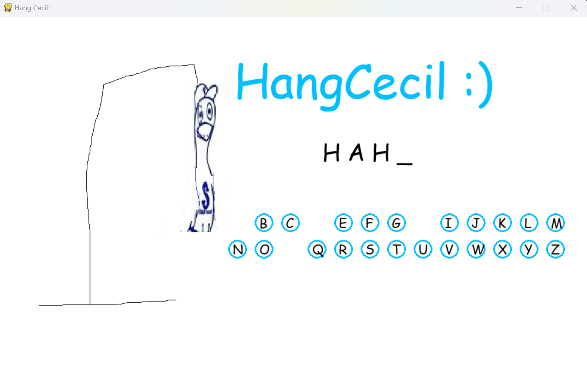

# Pomona College Hangman with Cecil the Sagehen

## Description

Welcome to Pomona College Hangman with Cecil the Sagehen! This Python game replicates the classic hangman experience, but with a fun and educational twist. Instead of the traditional hangman figure, you'll be helping Cecil the Sagehen, the beloved mascot of Pomona College, navigate through the game.

## Features

- **Pomona College Theme:** Immerse yourself in the world of Pomona College with a custom-themed hangman game. All the words and phrases are related to the college and its vibrant community.

- **Cecil the Sagehen:** Say goodbye to the grim hangman figure! In this game, you'll be helping Cecil, the cheerful and charismatic Sagehen, as he tries to guess the hidden words.

- **Educational:** Test your knowledge of Pomona College's history, landmarks, and traditions while playing this entertaining word game. Learn fun facts about the college along the way.

- **Special Pomona Words:** Discover unique and exciting words and phrases related to Pomona College. From campus buildings to famous alumni, there's a word for every Sagehen enthusiast.

- **Customizable Difficulty:** Choose from different difficulty levels to challenge yourself. Whether you're a Pomona College expert or just getting started, there's a level for you.

## How to Play

1. Run the Python script to start the game.

2. Cecil the Sagehen will appear on the screen, ready to play.

3. You'll receive a hint for the word or phrase related to Pomona College, and Cecil will start guessing letters.

4. Enter your guesses one letter at a time. Cecil will react to your guesses as you go.

5. If you guess a letter correctly, it will appear in the word. If not, Cecil will inch closer to solving the puzzle.

6. Try to guess the word before Cecil runs out of guesses. The fewer incorrect guesses, the better!

7. Celebrate your victories with Cecil and learn more about Pomona College with each game.

# Demo Image

## Requirements

- Python 3.x
- Pygame library

## Installation

1. Clone this repository or download the game files.
